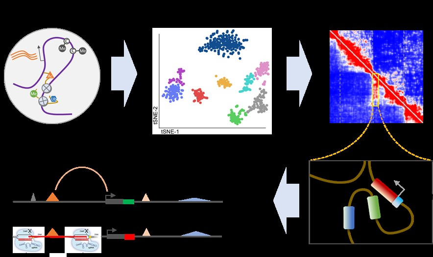

# **Welcome to Li Lab @ BIOPIC**

[**Research**](discription)---[**Team**](Team)---[**Publications**](Publications)---[**Outreach**](discription)---[**Contact**](discription)

## Research Interest

We commit to use single-cell multi-omics and functional genomics to examine the mechanisms and functions of epigenetic modifications, 3D genome organization, and non-coding cis-regulatory elements in regulating gene expression, which will be the foundation to further understand gene regulation in cell fate decision, embryo development, and its dysregulation in variety of human diseases.

## Publications
####Leading/co-first author publications: (*Equal contribution)

Guoqiang Li*, Yaping Liu*, Yanxiao Zhang, Naoki Kubo, Miao Yu, Rongxin Fang, Manolis Kellis and Bing Ren. “Joint profiling of DNA methylation and chromatin architecture in single cells.” Nature Methods, 16 (2019): 991–993.

Xiaocui Xu*, Guoqiang Li*, Congru Li*, Jing Zhang*, Qiang Wang*, David K Simmons, Xuepeng Chen, Naveen Wijesena, Wei Zhu, Zhanyang Wang, Zhenhua Wang, Bao Ju, Weimin Ci, Xuemei Lu, Daqi YuQian-fei Wang, Neelakanteswar Aluru, Paola Oliveri, Yong E Zhang, Mark Q Martindale and Jiang Liu. “Evolutionary transition between invertebrates and vertebrates via methylation reprogramming in embryogenesis.” National Science Review, nwz064 (2019), https://doi.org/10.1093/nsr/nwz064

Congru Li*, Yang Yu*, Yong Fan*, Guoqiang Li*, Xiaocui Xu, Jialei Duan, Rong Li, Xiangjin Kang, Xin Ma, Xuepeng Chen, Yuwen Ke, Jie Yan, Ying Lian, Ping Liu, Yue Zhao, Hongcui Zhao, Yaoyong Chen, Xiaofang Sun, Jianqiao Liu, Jie Qiao and Jiang Liu. “DNA methylation reprogramming of functional elements during mammalian embryonic development.” Cell Discovery 4, no. 28 (2018).

Guoqiang Li*, Yang Yu*, Yong Fan*, Congru Li*, Xiaocui Xu, Jialei Duan, Rong Li, Xiangjin Kang, Xin Ma, Xuepeng Chen, Yuwen Ke, Jie Yan, Ying Lian, Ping Liu, Yue Zhao, Hongcui Zhao, Yaoyong Chen, Xiaofang Sun, Jianqiao Liu, Jie Qiao and Jiang Liu. “Genome-wide abnormal DNA methylome of human blastocyst in assisted reproductive technology.” Journal of Genetics and Genomics 44 (2017): 475-481.

Guoqiang Li*, Weimin Ci*, Subhradip Karmakar*, Ke Chen, Zhixiang Fan, Zhongqiang Guo, Jing Zhang, Lu Wang, Min Zhuang, Shengdi Hu, Xuesong Li, Xianghong Li, Matthew F. Calabrese, Edmond R. Watson, Sandip Prasad, Carrie Rinker-Schaeffer, Scott E. Eggener, Thomas Stricker, Yong Tian, Brenda Schulman, Jiang Liu and Kevin P. White. “SPOP promotes tumorigenesis by acting as a key regulatory hub in kidney cancer.” Cancer Cell 25, no. 4 (2014): 455-468.

####Co-authored publications:

Rongxin Fang, Miao Yu, Guoqiang Li, Sora Chee, Tristin Liu, Anthony D Schmitt and Bing Ren. “Mapping of long-range chromatin interactions by proximity ligation-assisted ChIP-seq.” Cell Research 26 (2016): 1345-1348.

Zhong-Qiang Guo*, Tong Zheng*, Baoen Chen*, Cheng Luo*, Sisheng Ouyang*, Shouzhe Gong, Jiafei Li, Liu-Liang Mao, Fulin Lian, Yong Yang, Yue Huang, Li Li, Jing Lu, Bidong Zhang, Luming Zhou, Hong Ding, Zhiwei Gao, Liqun Zhou, Guoqiang Li, Ran Zhou, Ke Chen, Jingqiu Liu, Yi Wen, Likun Gong, Yuwen Ke, Shang-Dong Yang, Xiao-Bo Qiu, Naixia Zhang, Jin Ren, Dafang Zhong, Cai-Guang Yang, Jiang Liu and Hualiang Jiang. “Small-Molecule Targeting of E3 Ligase Adaptor SPOP in Kidney Cancer.” Cancer Cell 30, no.3 (2016): 474–484.

John Arne Dahl*, Inkyung Jung*, Håvard Aanes, Gareth D. Greggains, Adeel Manaf, Mads  Lerdrup, Guoqiang Li, Samantha Kuan, Bin Li, Ah Young Lee, Sebastian Preissl, Ingunn Jermstad, Mads Haugland Haugen, Rajikala Suganthan1, Magnar Bjørås, Klaus Hansen,   Knut Thomas Dalen, Peter Fedorcsak, Bing Ren and Arne Klungland.  “Broad histone H3K4me3 domains in mouse oocytes modulate maternal to zygotic transition” Nature 537 (2016): 548–552.

Wang Lu*, Jun Zhang*, Jialei Duan*, Xingxing Gao*, Wei Zhu, Xingyu Lu, Lu Yang, Jing Zhang, Guoqiang Li, Weimin Ci, Wei Li, Qi Zhou, Neel Aluru, Fuchou Tang, Chuan He, Xingxu Huang and Jiang Liu. "Programming and inheritance of parental DNA methylomes in mammals." Cell 157, no.4 (2014): 979-991.

Jiang Lan*, Jing Zhang*, Jing-Jing Wang*, Lu Wang, Li Zhang, Guoqiang Li, Xiaodan Yang, Xin Ma, Xin Sun, Jun Cai, Jun Zhang, Xingxu Huang, Miao Yu, Xuegeng Wang, Feng Liu, Chung- I. Wu, Chuan He, Bo Zhang, Weimin Ci and Jiang Liu. "Sperm, but Not Oocyte, DNA Methylome Is Inherited by Zebrafish Early Embryos." Cell 153, no. 4 (2013): 773-784.

##PATENT
Jiang Liu, Jie Qiao, Guoqiang Li, Yang Yu, Yong Fan and Congru Li, “Noninvasive detection method for screening healthily-growing blastulas.” No. WO2017177900A1

For [full publications](https://scholar.google.com/citations?hl=en&user=xVy1jCUAAAAJ).

## About the PI

## We are hiring!

Postdocs in the field of genetics, genomics, and bioinformatics are welcome to join! Please send you CV and representive publications to gul030@health.ucsd.edu. Please also arrange 1-2 recommendations from PhD mentor and other's. 

## About BIOPIC and Peking University

Check out [BIOPIC](https://biopic.pku.edu.cn/english/index.htm)   [Peking University](http://english.pku.edu.cn/)

## Contact

Email: gul030@health.ucsd.edu
Twitter: @sky_jasonli
