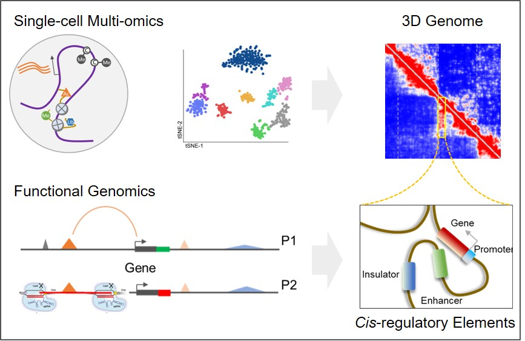

# **Welcome to Li Lab @ BIOPIC**

[**Research**](discription)---[**Team**](Team)---[**Publications**](Publications)---[**Outreach**](discription)---[**Contact**](discription)

## Research Interest

We commit to use single-cell multi-omics and functional genomics to examine the mechanisms and functions of epigenetic modifications, 3D genome organization, and non-coding cis-regulatory elements in regulating gene expression, which will be the foundation to further understand gene regulation in cell fate decision, embryo development, and its dysregulation in variety of human diseases.

## We are hiring!

Postdocs in the field of genetics, genomics, and bioinformatics are welcome to join! Please send you CV and representive publications to gul030@health.ucsd.edu. Please also arrange 1-2 recommendations from PhD mentor and other's. 

## About BIOPIC and Peking University

Check out [BIOPIC](https://biopic.pku.edu.cn/english/index.htm)   [Peking University](http://english.pku.edu.cn/)

## Contact

Email: gul030@health.ucsd.edu
Twitter: @sky_jasonli
